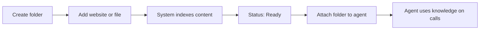

## What is Infobase?

**Infobase** is OneInbox's knowledge management layer. It stores information from **websites** and **uploaded documents** in **folders**, so **AI voice agents** can use that content during live phone conversations.

<Note>
  Infobase is organized into **folders**. Each folder can contain website URLs and uploaded files. You attach an entire folder to one or more agents — not individual files one-by-one on the agent.
</Note>

### What Infobase is

- A **folder-based knowledge library** for your agents
- A way to combine **web pages** and **files** in one place
- A bridge between your content and **agent behavior on calls**

---

## How Infobase works

1. You **create a folder** in the Infobase screen.
2. You **add sources** — website URLs or uploaded files.
3. The **system crawls or parses** content and builds a searchable index (**In Progress** → **Ready**).
4. You **attach the folder** to an agent in the Agent **Role** tab.
5. During **live calls**, the agent retrieves relevant knowledge from that folder.

You do not manually "train" a model in Infobase. You **supply sources** and wait until they are **Ready**.

---

## Your work and automatic processing

### What you do in OneInbox

- **Folders** — Create, organize, and delete Infobase folders
- **Websites** — Add URLs and choose which pages to include
- **Files** — Upload PDF, DOCX, PPTX, TXT, or CSV
- **Status** — Watch the folder list and use **↻ refresh** when you need an update
- **Website changes** — Refresh manually after your live site changes (OneInbox does not re-crawl on its own)
- **Team** — Optionally assign users to a folder (based on your org’s permissions)
- **Agents** — Attach a folder on the agent **Role** tab
- **Cleanup** — Delete individual files or entire folders

### What OneInbox handles for you

- Crawls and indexes the website pages you selected
- Parses and indexes uploaded files
- Processes each source (**In Progress** → **Ready**)
- Re-indexes when you re-upload a file or refresh a folder
- Supplies that knowledge to agents during live calls
- Removes indexed content when you delete a source

<Note>
  **Editing files:** You cannot change uploaded file content inside OneInbox. Edit the file in your usual app, then **re-upload** it to the same folder and wait until it is **Ready**.
</Note>

---

## Supported upload formats

You can upload the following file types to an Infobase folder:

| Format | Type |
| --- | --- |
| **PDF** | Documents |
| **DOCX** | Microsoft Word |
| **PPTX** | Microsoft PowerPoint |
| **TXT** | Plain text |
| **CSV** | Tabular data |

---

## Editing uploaded files

To change document content:

1. Edit the file in your usual tool (Microsoft Word, PowerPoint, Acrobat, etc.).
2. **Re-upload** the revised file to the same Infobase folder in OneInbox.
3. Wait until status is **Ready**.
4. If the folder is attached to agents, allow indexing to finish before expecting updated answers on calls.

You may delete the older file row after re-uploading if you want to avoid duplicate entries in the folder list.

---

## Website content updates

When a live website changes (new pages, revised copy, removed URLs):

- OneInbox does **not** automatically re-crawl or sync website content in the background.
- You must use the **manual refresh icon (↻)** next to the folder status to check and update processing status.
- If the site structure changed significantly, you may need to add URLs again or adjust which pages are indexed.

---

## Other limitations

### Processing and agents

- Sources with **In Progress** status are **not fully available** to agents.
- Attaching a folder before all items are **Ready** can cause **incomplete** answers on calls.

### Websites

- Crawling depends on how the site is built. Login-only pages, heavy JavaScript apps, or blocked crawlers may not index fully.

### Deletion

- Deleting a file removes it from the folder and from agent knowledge.
- Deleting a folder removes **all** content inside. Detach the folder from agents first to avoid orphaned attachments.

### Permissions

- Who can create folders, assign users, or delete content may depend on your organization's OneInbox roles. Contact your administrator if an action is unavailable.

---

## Frequently asked questions

<AccordionGroup>
  <Accordion title="Can I edit a PDF or Word file inside OneInbox?">
    No. Edit the file externally, then **re-upload** it.
  </Accordion>
  <Accordion title="Does the platform automatically update when our website changes?">
    No. Use **manual refresh (↻)** on the folder. Re-add or adjust URLs if the site structure changed.
  </Accordion>
  <Accordion title="Can I upload PowerPoint files?">
    Yes. **PPTX** is supported along with PDF, DOCX, TXT, and CSV.
  </Accordion>
  <Accordion title="When can agents use new content?">
    After the file or URL shows **Ready**. If the folder is already attached to an agent, indexing must complete first.
  </Accordion>
  <Accordion title="What is the difference between a folder and an agent?">
    A **folder** holds knowledge sources. An **agent** is your voice AI configuration. You **attach** folders to agents so calls can use that knowledge.
  </Accordion>
</AccordionGroup>

---

## Step-by-step guide

## Step 1: Navigate to Infobase

From the left sidebar, click the **Infobase icon** (stacked layers icon at the bottom of the nav). You will land on the Infobase section, which displays all your folders and the files inside them.

> In this example, the **Business** folder contains one file — `Webinar_AI SDR Workshop.pptx` — with a status of **In Progress**, meaning it is still being processed.

---

## Step 2: Add a Folder

Before adding websites or files, create a folder to organize your knowledge base.

1. In the left **Infobases** menu panel, click the **+** button next to the **Infobases** heading.
2. Enter a name for your folder (for example, `Business` or `Product Docs`).
3. Confirm to create the folder.

The new folder appears in the Infobases list on the left. Click the folder to open it in the main view — you will add content in the next step.

---

## Step 3: Add Information to a Folder

Open the folder you created, then click **+ Add Info** in the top-right corner of the folder view.

A modal will appear with two options:

| Option | Description |
|---|---|
| **Website** | Provide a URL — OneInbox will crawl and index the pages automatically |
| **Upload File** | Upload a document (PDF, DOCX, PPTX, TXT, or CSV) |

Select the appropriate option and click **Next**.

---

## Step 4a: Add a Website

If you select **Website**, you will be prompted to enter a URL.

Enter the root domain or a specific page URL and click **Next**. OneInbox will crawl the site and return a list of all discoverable pages.

### Select Pages to Index

After crawling, a checklist of all found URLs will appear. By default, all pages are selected.

- Use **Select all** to include every page, or manually check/uncheck individual URLs.
- Use the **Filter URLs** field to search for specific pages within the list.

Click **Next** to confirm your selection.

<Tip>
  You can continue adding more sources (additional websites or files) from this same screen before clicking **Next** to finalize.
</Tip>

---

## Step 4b: Upload a File

If you select **Upload File**, click the **Upload File** card and your system file picker will open.

Select the file you want to upload (supported formats: **PDF, DOCX, PPTX, TXT, CSV**) and click **Open**.

The file will appear in the modal with a green checkmark confirming it has been staged for upload.

Click **Next** to confirm and begin processing.

---

## Step 5: Monitor Processing Status

Once sources are submitted, you will be returned to the folder view. All newly added files and URLs will appear in the list with one of the following statuses:

| Status | Meaning |
|---|---|
| **In Progress** | Content is currently being crawled or processed |
| **Ready** | Content has been indexed and is available for agent use |

### Refreshing status (manual)

OneInbox does **not** automatically re-sync website content when a live site changes. To check processing status or pick up updates after you have changed sources, click the **refresh icon (↻)** next to the status badge at the top of the folder.

---

## Step 6: Assign Users to a Folder (Optional)

You can assign team members to a specific Infobase folder. Click the **+** icon next to the refresh button to open the user assignment dropdown.

Select one or more users from the dropdown. This is useful for access control and team ownership of specific knowledge bases.

---

## Step 7: Attach an Infobase to an Agent

Once your Infobase folder is ready, you can attach it to any agent.

1. Navigate to **Agents** from the left sidebar.
2. Select the agent you want to configure.
3. Go to the **Role** tab.
4. On the right side, locate the **Add attachment** panel.
5. Click **Select file** and choose the Infobase folder from the dropdown.

The folder will appear listed under attachments.

6. Click **Save** to apply the changes.

<Check>
  Your agent will now reference the Infobase content during live conversations.
</Check>

---

## Step 8: Delete a File

To remove a single file or URL from a folder, open the folder and find the item in the list.

1. Hover over the row you want to remove.
2. Click the **trash icon** on the far right of that row.
3. Confirm the deletion when prompted.

<Warning>
  Deleting a file permanently removes it from the folder. If the folder is attached to an agent, that content will no longer be available during calls.
</Warning>

---

## Step 9: Delete a Folder

To remove an entire Infobase folder and all files inside it:

1. Open the folder you want to delete (or select it from the **Infobases** list on the left).
2. Click the **⋮** (three dots) menu in the top-right of the folder view, next to **+ Add Info**.
3. Select **Delete** from the dropdown.
4. Confirm the deletion when prompted.

<Warning>
  Deleting a folder removes all files and URLs inside it. Detach the folder from any agents first if you want to avoid broken attachments.
</Warning>

---

## Summary

| Step | Action |
|---|---|
| 1 | Navigate to Infobase from the sidebar |
| 2 | Click **+** next to **Infobases** in the left menu, name the folder, and create it |
| 3 | Open the folder and click **+ Add Info** |
| 4 | Add a website URL or upload a file (PDF, DOCX, PPTX, TXT, CSV) |
| 5 | Wait for **Ready**; use **↻** to refresh status manually |
| 6 | Optionally assign team members to the folder |
| 7 | Attach the folder to an agent via the Role tab and save |
| 8 | Delete individual files using the trash icon on each row |
| 9 | Delete an entire folder via the **⋮** menu → **Delete** |

<Warning>
  Files with **In Progress** status have not yet been indexed. Attaching a folder to an agent before all sources are **Ready** may result in incomplete knowledge coverage during calls.
</Warning>