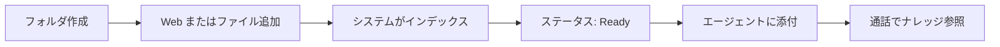

## Infobase とは

**Infobase** は OneInbox のナレッジ管理機能です。**Web サイト** と **アップロードしたドキュメント** を **フォルダ** にまとめ、**AI 音声エージェント** が通話中にその内容を参照できるようにします。

<Note>
  Infobase は **フォルダ** 単位で管理します。各フォルダに URL とファイルを混在させ、フォルダ全体を 1 つ以上のエージェントに添付します（エージェントごとにファイルを 1 件ずつ選ぶ方式ではありません）。
</Note>

### Infobase でできること

- エージェント向けの **ナレッジライブラリ**（フォルダ）の作成
- **Web ページ** と **ファイル** の一元管理
- コンテンツと **通話時のエージェント応答** の連携

---

## 全体の流れ

1. Infobase 画面で **フォルダを作成**します。
2. **Web サイトの URL** または **ファイル** を追加します。
3. **システムがクロール／解析**し、検索可能な状態にします（**In Progress** → **Ready**）。
4. エージェントの **Role** タブで **フォルダを添付**します。
5. **通話中**、エージェントがフォルダ内のナレッジを参照します。

Infobase 上でモデルを手動「学習」する操作はありません。**ソースを登録**し、**Ready** になるまで待ちます。

---

## 操作と自動処理

### ご自身で行うこと

- **フォルダ** — Infobase フォルダの作成・整理・削除
- **Web サイト** — URL の登録とインデックス対象ページの選択
- **ファイル** — PDF、DOCX、PPTX、TXT、CSV のアップロード
- **ステータス** — フォルダ一覧の確認、必要に応じて **↻ 更新**
- **Web サイトの変更** — 公開サイト変更後は手動で更新（自動再クロールはありません）
- **チーム** — 必要に応じてフォルダにユーザーを割り当て（組織の権限に従います）
- **エージェント** — エージェントの **Role** タブでフォルダを添付
- **削除** — 個別ファイルまたはフォルダ全体の削除

### OneInbox が自動で行うこと

- 選択した Web ページのクロールとインデックス
- アップロードファイルの解析とインデックス
- 各ソースの処理（**In Progress** → **Ready**）
- 再アップロードまたはフォルダ更新時の再インデックス
- 通話中のエージェントへのナレッジ提供
- ソース削除時のインデックス除去

<Note>
  **ファイルの編集：** OneInbox 上ではアップロード済みファイルの本文は編集できません。通常のツールで修正し、同じフォルダに**再アップロード**して **Ready** になるまでお待ちください。
</Note>

---

## 対応アップロード形式

Infobase フォルダにアップロードできる形式は次のとおりです。

| 形式 | 種類 |
| --- | --- |
| **PDF** | 文書 |
| **DOCX** | Microsoft Word |
| **PPTX** | Microsoft PowerPoint |
| **TXT** | テキスト |
| **CSV** | 表形式データ |

---

## アップロード済みファイルの編集

内容を変更する場合:

1. Word、PowerPoint、Acrobat など**社内の通常ツール**でファイルを修正します。
2. 同じ Infobase フォルダに**修正版を再アップロード**します。
3. ステータスが **Ready** になるまで待ちます。
4. エージェントにフォルダを添付済みの場合は、インデックス完了後に通話内容へ反映されます。

一覧に同じファイルが重複する場合は、古い行を削除して整理できます。

---

## Web サイトの内容更新

公開中の Web サイトが変更された場合（ページ追加、文言変更、URL 削除など）:

- OneInbox は**バックグラウンドで自動的に再クロールしません**。
- フォルダ上部のステータス横にある **↻（手動更新）** で処理状況を確認・更新してください。
- サイト構成が大きく変わった場合は、URL の再登録やインデックス対象ページの見直しが必要になることがあります。

---

## その他の制限事項

### 処理とエージェント

- **In Progress** のソースは、エージェントが**十分に参照できません**。
- すべて **Ready** になる前にエージェントへ添付すると、通話時の回答が**不完全**になることがあります。

### Web サイト

- ログイン必須ページ、JavaScript 中心のサイト、クローラー拒否などにより、すべてのページが取得できない場合があります。

### 削除

- ファイルを削除すると、フォルダおよびエージェントのナレッジから除去されます。
- フォルダ削除は**中身すべて**が削除されます。事前にエージェントから添付を外すことを推奨します。

### 権限

- フォルダ作成、ユーザー割り当て、削除などができるかは組織の OneInbox 権限によります。操作できない場合は管理者にお問い合わせください。

---

## よくある質問

<AccordionGroup>
  <Accordion title="PDF や Word を OneInbox 内で編集できますか？">
    いいえ。外部で編集し、**再アップロード**してください。
  </Accordion>
  <Accordion title="Web サイトを更新したら自動で反映されますか？">
    いいえ。**手動で ↻ 更新**してください。構成が変わった場合は URL の再登録が必要な場合があります。
  </Accordion>
  <Accordion title="PowerPoint（PPTX）は使えますか？">
    はい。**PPTX** は PDF、DOCX、TXT、CSV とあわせて対応しています。
  </Accordion>
  <Accordion title="いつからエージェントが新しい内容を使えますか？">
    該当ソースが **Ready** になってからです。フォルダ添付済みの場合も、インデックス完了を待ってください。
  </Accordion>
  <Accordion title="フォルダとエージェントの違いは？">
    **フォルダ**はナレッジの入れ物、**エージェント**は音声 AI の設定です。フォルダをエージェントに**添付**して通話で使います。
  </Accordion>
</AccordionGroup>

---

## 操作手順

## ステップ 1: Infobase 画面を開く

左サイドバー下部の **Infobase アイコン**（積み重ねたレイヤーアイコン）をクリックします。フォルダ一覧と各フォルダ内のファイルが表示されます。

> 例では **Business** フォルダに `Webinar_AI SDR Workshop.pptx` が 1 件あり、ステータスは **In Progress**（処理中）です。

---

## ステップ 2: フォルダを作成する

Web サイトやファイルを追加する前に、ナレッジを整理するフォルダを作成します。

1. 左の **Infobases** メニューで、**Infobases** 見出し横の **+** をクリックします。
2. フォルダ名を入力します（例: `Business`、`Product Docs`）。
3. 作成を確定します。

新しいフォルダが左の Infobases 一覧に表示されます。フォルダをクリックしてメイン画面を開き、次のステップでコンテンツを追加します。

---

## ステップ 3: フォルダに情報を追加する

作成したフォルダを開き、フォルダ画面右上の **+ Add Info** をクリックします。

モーダルに 2 つの選択肢が表示されます。

| 選択肢 | 説明 |
|---|---|
| **Website** | URL を指定 — OneInbox がページをクロールしてインデックスします |
| **Upload File** | 文書をアップロード（PDF、DOCX、PPTX、TXT、CSV） |

該当する選択肢を選び **Next** をクリックします。

---

## ステップ 4a: Web サイトを追加する

**Website** を選ぶと URL の入力画面が表示されます。

ルートドメインまたは特定ページの URL を入力し **Next** をクリックします。クロール後、検出されたページ一覧が表示されます。

### インデックスするページを選択

クロール後、URL のチェックリストが表示されます。初期状態では多くの場合すべて選択されています。

- **Select all** で全ページを含めるか、個別にチェックを入れ外しします。
- **Filter URLs** で一覧内を検索できます。

**Next** で選択を確定します。

<Tip>
  同じ画面から追加の Web サイトやファイルを続けて登録してから **Next** で確定できます。
</Tip>

---

## ステップ 4b: ファイルをアップロードする

**Upload File** を選ぶと **Upload File** カードをクリックし、OS のファイル選択ダイアログが開きます。

アップロードするファイル（**PDF、DOCX、PPTX、TXT、CSV**）を選び **Open** をクリックします。

モーダルに緑のチェックマーク付きでアップロード待ちとして表示されます。

**Next** で確定し、処理を開始します。

---

## ステップ 5: 処理ステータスを確認する

ソース送信後、フォルダ画面に戻ります。追加したファイルと URL は次のいずれかのステータスで表示されます。

| ステータス | 意味 |
|---|---|
| **In Progress** | クロールまたは処理の途中 |
| **Ready** | インデックス完了。エージェントが利用可能 |

### ステータスの更新（手動）

公開中の Web サイトが変更されても、OneInbox は**自動で再同期しません**。処理状況の確認やソース変更後の反映には、フォルダ上部のステータス横 **↻（更新）** をクリックしてください。

---

## ステップ 6: フォルダにユーザーを割り当てる（任意）

チームメンバーをフォルダに割り当てられます。更新ボタン横の **+** をクリックしてユーザー割り当てを開きます。

ドロップダウンから 1 名以上を選択します。アクセス制御や担当整理に利用できます。

---

## ステップ 7: エージェントに Infobase を添付する

フォルダの準備ができたら、任意のエージェントに添付します。

1. 左サイドバーから **Agents** を開きます。
2. 設定するエージェントを選択します。
3. **Role** タブを開きます。
4. 右側の **Add attachment** パネルを確認します。
5. **Select file** をクリックし、ドロップダウンから Infobase フォルダを選びます。

フォルダが添付一覧に表示されます。

6. **Save** で変更を保存します。

<Check>
  エージェントは通話中に Infobase の内容を参照できるようになります。
</Check>

---

## ステップ 8: ファイルを削除する

フォルダ内の 1 件のファイルまたは URL を削除する場合:

1. フォルダを開き、対象行を探します。
2. 行にマウスを合わせ、右端の **ゴミ箱アイコン** をクリックします。
3. 確認ダイアログで削除を確定します。

<Warning>
  削除するとフォルダから恒久的に除去されます。エージェントに添付している場合、通話でその内容は参照されなくなります。
</Warning>

---

## ステップ 9: フォルダを削除する

フォルダ全体と中身をすべて削除する場合:

1. 削除するフォルダを開く（または左 **Infobases** 一覧から選択）。
2. **+ Add Info** 横の **⋮**（三点メニュー）をクリックします。
3. **Delete** を選択します。
4. 確認ダイアログで削除を確定します。

<Warning>
  フォルダ削除は中のファイルと URL をすべて削除します。添付の不整合を避けるため、先にエージェントから外すことを推奨します。
</Warning>

---

## まとめ

| ステップ | 操作 |
|---|---|
| 1 | サイドバーから Infobase を開く |
| 2 | 左メニュー **Infobases** 横の **+** でフォルダを作成 |
| 3 | フォルダを開き **+ Add Info** をクリック |
| 4 | Web サイト URL またはファイル（PDF、DOCX、PPTX、TXT、CSV）を追加 |
| 5 | **Ready** まで待つ。**↻** で手動更新 |
| 6 | 任意でチームメンバーをフォルダに割り当て |
| 7 | Role タブでフォルダを添付して保存 |
| 8 | 各行のゴミ箱アイコンでファイルを削除 |
| 9 | **⋮** メニュー → **Delete** でフォルダ全体を削除 |

<Warning>
  **In Progress** のソースはまだインデックスされていません。すべて **Ready** になる前にエージェントへ添付すると、通話時のナレッジが不完全になることがあります。
</Warning>