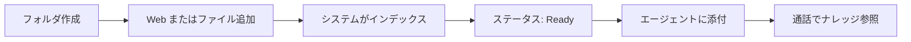

## 本ガイドの対象者

本ドキュメントは、**Infobase を初めて利用する企業のお客様**向けです。日本国内のユーザーで、Infobase に馴染みがない方でも理解できるよう、専門用語を避けて説明しています。

**学べる内容:**

- Infobase とは何か、OneInbox でどのような役割か
- **画面（フロントエンド）** で行う操作と **システム（バックエンド）** が自動で行う処理
- **制限事項**（ファイル編集、Web サイトの更新方法など）
- [操作手順](/ja/user-guide) のステップバイステップガイド

---

## Infobase とは

**Infobase** は OneInbox のナレッジ管理機能です。**Web サイト** と **アップロードしたドキュメント** を **フォルダ** にまとめ、**AI 音声エージェント** が通話中にその内容を参照できるようにします。

<Note>
  Infobase は **フォルダ** 単位で管理します。各フォルダに URL とファイルを混在させ、フォルダ全体を 1 つ以上のエージェントに添付します（エージェントごとにファイルを 1 件ずつ選ぶ方式ではありません）。
</Note>

### Infobase でできること

- エージェント向けの **ナレッジライブラリ**（フォルダ）の作成
- **Web ページ** と **ファイル** の一元管理
- コンテンツと **通話時のエージェント応答** の連携

### Infobase でないもの

- 画面上で文書を編集する DMS（文書管理システム）ではありません
- OneInbox 内で本文を編集する Wiki / CMS ではありません
- CRM やチケット管理の代替ではありません

---

## 全体の流れ

1. Infobase 画面で **フォルダを作成**します。
2. **Web サイトの URL** または **ファイル** を追加します。
3. **システムがクロール／解析**し、検索可能な状態にします（**In Progress** → **Ready**）。
4. エージェントの **Role** タブで **フォルダを添付**します。
5. **通話中**、エージェントがフォルダ内のナレッジを参照します。

Infobase 上でモデルを手動「学習」する操作はありません。**ソースを登録**し、**Ready** になるまで待ちます。

---

## フロントエンドとバックエンド

| 項目 | フロントエンド（画面での操作） | バックエンド／システム |
| --- | --- | --- |
| フォルダの作成・削除 | 可 | — |
| Web サイト登録・ページ選択 | 可 | クロール・インデックス |
| ファイルのアップロード（PDF, DOCX, PPTX, TXT, CSV） | 可 | 解析・インデックス |
| アップロード済みファイルの画面上での編集 | **不可（ロードマップにもなし）** | — |
| 外部編集後のファイル更新 | **再アップロード** | 再インデックス（In Progress → Ready） |
| 処理状況の確認 | 可（一覧・**↻ 更新**） | 処理の実行 |
| Web サイト変更後の反映 | **手動更新のみ**（自動再クロールなし） | 更新操作時に再処理 |
| フォルダへのユーザー割り当て | 可（任意） | 組織の権限設定に依存 |
| エージェントへのフォルダ添付 | 可（Agents → Role） | 通話時の参照 |
| ファイル・フォルダの削除 | 可 | インデックスから削除 |

<Card title="制限事項とファイルの更新" icon="triangle-exclamation" href="/ja/limitations">
  対応形式、編集ポリシー、Web 更新、FAQ を確認してください。
</Card>

<Card title="操作手順" icon="list-ol" href="/ja/user-guide">
  画面操作のステップバイステップ手順です。
</Card>

---

## 用語集

| 用語 | 意味 |
| --- | --- |
| **フォルダ** | Web サイトとファイルを入れる単位（例: Business） |
| **In Progress** | クロールまたは処理の途中 |
| **Ready** | インデックス完了。エージェントが利用可能 |
| **エージェント** | OneInbox の AI 音声設定 |
| **添付（Attachment）** | Role タブで Infobase フォルダをエージェントに紐づけること |
